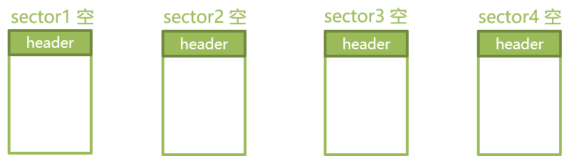
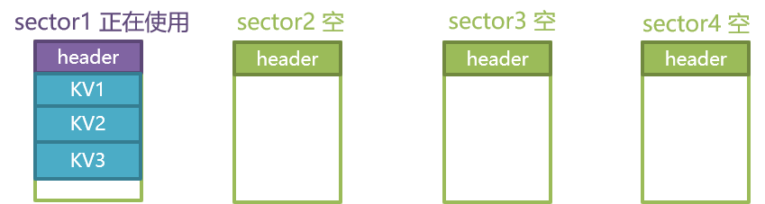
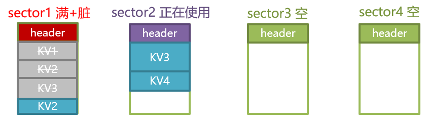
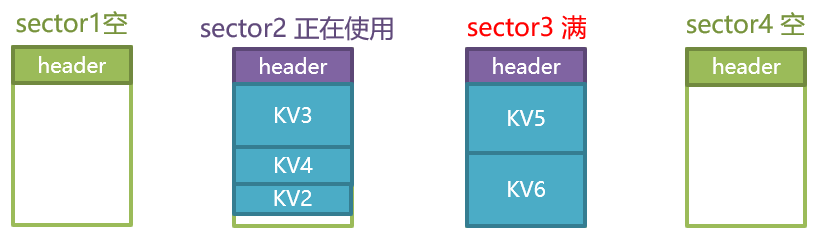
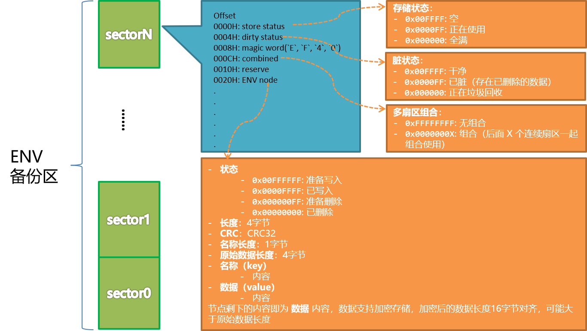

# EasyFlash V4.0 ENV 功能设计与实现

## 1、为什么要开发 V4.0

EasyFlash 是我个人开发的第二款开源软件，自  2015 年初正式开源出来，至今（2019.02）已经经历了 4 年多时间。期间有很多其他行业的嵌入式开发者与我取得联系，得知他们已经将  EasyFlash  应用于自己的产品上，我心里也倍感欣慰，可见 EasyFlash 的成熟性已经得到了很多行业的认可。

### 1.1 功能简洁，但性能差强人意

大家普遍的感觉是 EasyFlash 功能简洁，可以很容易的应用于产品上。但随着技术的演进，大家对于 KV 需求的多样化，对于 MCU 资源（主要是 RAM）、Flash 存储资源、Flash 寿命等性能指标越来越高，旧版本的 EasyFlash 在这些方面还是有提升的空间。比如：

### 1.2 旧版本的痛点

- 每个存储在 Flash 上的 ENV 都会在 RAM 中缓存一份，这样做虽然能够简化实现，但确实会占用很多 RAM 资源；
- ENV 的值类型只支持字符串，如果想要保存其他类型的值（比如：数组、结构体）就比较麻烦了，虽然我后来为此又专门开发了 [struct2json](https://github.com/armink/struct2json) 开源软件，但还是不够便捷；
- 每次保存 ENV 都需要重新擦写整个 Flash 扇区，那么位于扇区尾部未使用的区域始终无法得到利用，降低了 Flash 的使用效率，也就降低了 Flash 的使用寿命

### 1.3 从 0 开始的 NG 版本

也就是从 2017 年初开始，我便开始准备 EasyFlash 的性能优化工作，结合大家的需求，不断的整理、迭代设计文档，也与一些社区爱好者做过非常深入的交流。最终确定下来，如果单纯的在原有基础上进行完善，那么会有太多的功能实现受到限制，所以干脆重新开发全新一代 ENV 功能组件，这个版本被命名为 NG(Next Generation) 版本。

NG 版本差不多在 2017 年底就已经设计完毕，但一直没时间去开发。后来在亲人的支持下，终于利用 2019 年猪年春节的假期，在岳父母家完成了 V4.0 NG 版本的开发（在此感谢岳父母、爱人的支持）。

## 2、V4.0 的特色有哪些

- 更小的资源占用，内存占用 **几乎为 0** ；
- ENV 的值类型支持 **任意类型** 、任意长度，相当于直接 memcpy 变量至 flash ；
- ENV 操作效率比以前的模式高，充分利用剩余空闲区域，擦除次数及操作时间显著降低；
- **原生支持** 磨损平衡、掉电保护功能 （V4.0 之前需要占用额外的 Flash 扇区）；
- ENV 支持 **增量升级** ，固件升级后 ENV 也支持升级；
- 支持大数据存储模式，**长度无限制**，数据可在多个 Flash 扇区上顺序存储。像脚本程序、音频等占用 Flash 超过 1 个扇区的资源也都可以存入 ENV；
- 支持 **数据加密** ，提升存储的安全性，物联网时代的必备功能；
- 支持 **数据压缩** ，减低 Flash 占用；

## 3、如何实现

### 3.1 算法

假定 ENV 分区里有 4 个扇区，以下将按照操作 ENV 的方式，逐一举例讲解不同操作下，对应的 Flash 状态及数据变化。

#### 3.1.1 ENV 操作过程1（常规模式）

##### 3.1.1.1 首次使用

首次使用时，EasyFlash 会检查各个扇区的 header，如果不符合规定的格式将执行全部格式化操作，格式化后，每个扇区的顶部将被存入 header ，负责记录当前扇区的状态、魔数等信息。格式化的初始化状态为空状态。

##### 3.1.1.2 添加 KV1、KV2、KV3

在执行添加操作前，会先检索合适地址来存放即将添加的新 KV，这里检索策略主要是：

- 确定当前选择的扇区剩余容量充足
- 优选选择正在使用状态的扇区，最后使用空状态扇区
- 检查新 KV 是否有同名的 KV 存在，存在还需要额外执行删除旧值的动作

通过上图可以看出， KV1、KV2 及 KV3 已经被放入 sector1 ，添加后，扇区状态也被修改为正在使用

##### 3.1.1.3 修改 KV2 KV3，删除 KV1，添加 KV4

修改 ENV 时，旧的 ENV 将被删除，扇区的状态也将被修改为脏状态，然后再执行新增 ENV 的操作。

- 执行修改 KV2 时，已经存在的 KV2 旧值被修改为已删除，sector1 状态被修改为脏状态，此后将 KV2 新值放入 sector1，发现 sector1 已经没有空间了，sector1 的状态还会被修改为已满状态；

- 执行修改 KV3 时，已经存在的 KV3 旧值被修改为已删除，sector1 状态已经为脏状态，无需再做修改。经过查找发现 KV3 的新值只能放到 sector2，放到 sector2 后将其修改为正在使用状态；
- 执行删除 KV1 时，找到 KV1 的位置，将其修改为已删除状态，sector1 状态已经为脏状态，无需再做修改；
- 执行添加 KV4 时，经过查找在 sector2 找到合适的存储位置，将其添加后，sector2 状态已经为正在使用状态，无需再做修改。

##### 3.1.1.4 添加 KV5 KV6，触发 GC

- 执行添加 KV5 操作，由于 KV5 体积较大，sector2 放不下，所以只能放在一个新扇区 sector3 上，添加后，修改 sector3 状态为正在使用
- 执行添加 KV6 操作，KV6 也只能放在 sector3 下，将其放入 sector 3 后，发现 sector3 空间已满，所以将其修改已满状态。执行完成后，发现整个 ENV 的 4 个扇区只有 1 个状态为空的扇区了，这个扇区如果再继续使用就没法再执行 GC 操作了，所以此时触发了 GC 请求；
- 执行 GC 请求，EasyFlash 会找到所有被标记为已满并且为脏状态的扇区，并将其内部的 ENV 搬运至其他位置。就这样 sector1 上的 KV2 被搬运至了 sector2，腾空 sector1 后，又对其执行了格式化操作，这样整个 ENV 分区里又多了一个空状态的扇区。

#### 3.1.2 ENV 操作过程2（开启大数据存储模式）

马上就来……

### 3.2 数据结构

结合上面的算法不难发现，其实所有的操作都围绕着 **扇区状态** 及 **ENV状态** ，这些状态将被存放在扇区及 ENV 头部，并且保证在不擦除扇区数据的前提下进行单向修改，在程序代码实现上称这些状态及其他一些数据信息为 **元数据**。

除了常规功能外，还有一项重要指标是 EasyFlash 非常看重的，那就是掉电保护能力，相当于在任何操作出现掉电异常，整个 EasyFlash 的容错能力是否过硬，是否可以进行掉电恢复。像 准备写入、准备删除这些中间状态就是为了掉电保护功能而设计。

出于后期扩展性的考虑这里也预留了一些保留属性，还有一些提前规划好的状态及属性后面将用过多扇区存储、加密、压缩功能的实现。

设计完成后，整个 ENV 的数据结构如下图，该图最终也可转换为对应的结构体。

